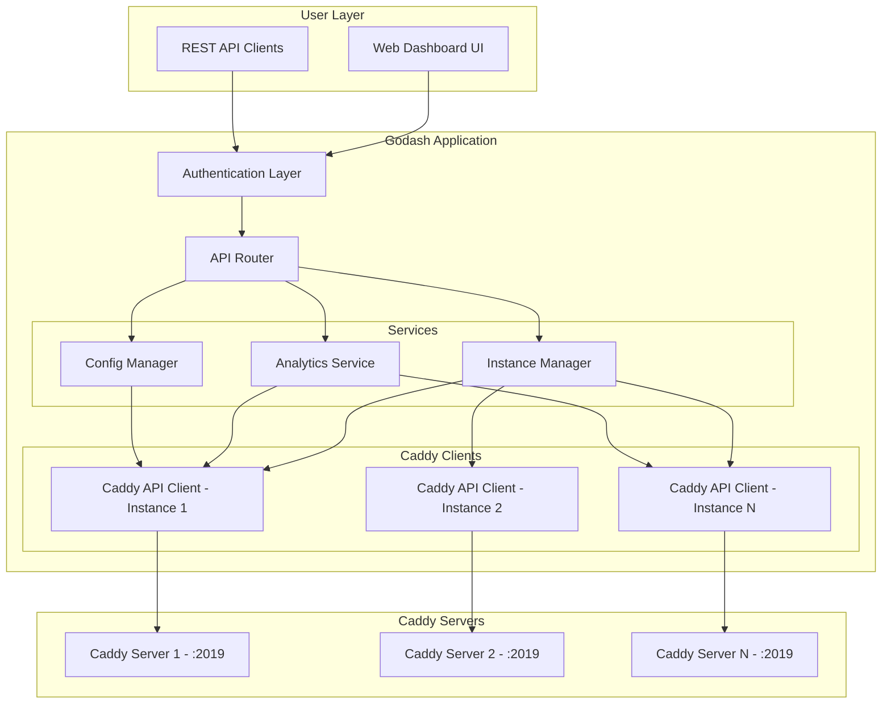
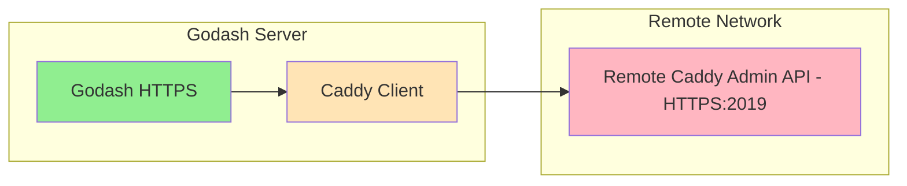

                # Godash + Caddy Integration Design Document

## Executive Summary

This document outlines the architecture and development plan for extending Godash into a Caddy webserver management dashboard.

**Key Design Decision: File-based Storage Only**
- No database required (MongoDB removed as dependency)
- All data stored as JSON files
- Simple deployment with zero external dependencies
- SQLite optional for user data if needed

The application will support:
- **Multi-instance management**: Connect to multiple Caddy servers
- **Real-time analytics**: Display traffic, request metrics, and performance data
- **Configuration control**: Start/stop instances, reload configs, manage sites
- **Unified dashboard**: Single pane of glass for all Caddy instances

---

## 1. Architecture Overview



---

## 2. Current Architecture Analysis

### Existing Components
- [`cmd/server/main.go`](cmd/server/main.go): Entry point, initializes services and routes
- [`internal/handlers/handlers.go`](internal/handlers/handlers.go): HTTP handlers for dashboard
- [`internal/services/dashboard_service.go`](internal/services/dashboard_service.go): Dashboard data generation
- [`internal/middleware/auth.go`](internal/middleware/auth.go): Session-based authentication
- [`internal/models/`](internal/models/): Data models for users, dashboard
- [`web/templates/dashboard.html`](web/templates/dashboard.html): Main dashboard template
- [`web/static/js/dashboard.js`](web/static/js/dashboard.js): Frontend JavaScript

### Key Patterns to Maintain
- Service layer abstraction for business logic
- Handler pattern for HTTP endpoints
- Model structs for data serialization
- Middleware for authentication/authorization

---

## 3. New Components Required

### 3.1 Directory Structure

```
godash/
├── cmd/server/main.go
├── internal/
│   ├── caddy/                          # NEW: Caddy integration
│   │   ├── client.go                   # Caddy API client wrapper
│   │   ├── models.go                   # Caddy-specific models
│   │   ├── instances.go                # Instance management service
│   │   ├── analytics.go                # Metrics collection
│   │   └── config.go                   # Configuration operations
│   └── ...
├── data/                               # NEW: file-based storage
│   ├── instances.json
│   ├── analytics/
│   │   └── {instance_id}/
│   │       └── {timestamp}.json
│   └── logs/
│       └── audit.log
└── ...
```

### 3.2 New Models

#### Caddy Instance Model
```go
// internal/caddy/models.go
type CaddyInstance struct {
    ID          string            `json:"id"`
    Name        string            `json:"name"`
    URL         string            `json:"url"`              // Admin API URL
    APIKeyFile  string            `json:"api_key_file"`     // Path to file containing API key
    Status      InstanceStatus    `json:"status"`
    Tags        []string          `json:"tags"`             // Grouping
    LastPing    time.Time         `json:"last_ping"`
    CreatedAt   time.Time         `json:"created_at"`
    UpdatedAt   time.Time         `json:"updated_at"`
}

type InstanceStatus string

const (
    StatusOnline     InstanceStatus = "online"
    StatusOffline    InstanceStatus = "offline"
    StatusUnknown    InstanceStatus = "unknown"
    StatusUpdating   InstanceStatus = "updating"
)
```

#### Analytics Models
```go
// internal/caddy/models.go
type InstanceMetrics struct {
    InstanceID    string                 `json:"instance_id"`
    Timestamp     time.Time              `json:"timestamp"`
    
    // Server metrics
    Uptime        int64                  `json:"uptime"`
    NumRequests   int64                  `json:"num_requests"`
    TotalTraffic  int64                  `json:"total_bytes"`
    
    // Per-site metrics
    Sites         map[string]SiteMetrics `json:"sites"`
    
    // Response codes
    StatusCodes   map[int]int64          `json:"status_codes"`
}

type SiteMetrics struct {
    Name          string  `json:"name"`
    Requests      int64   `json:"requests"`
    BytesSent     int64   `json:"bytes_sent"`
    BytesReceived int64   `json:"bytes_received"`
    LatencyAvg    float64 `json:"latency_avg_ms"`
}
```

### 3.3 Caddy API Client

```go
// internal/caddy/client.go
type CaddyClient struct {
    baseURL   string
    apiKey    string
    httpClient *http.Client
    timeout   time.Duration
}

// Key methods
func (c *CaddyClient) GetInfo() (*ServerInfo, error)
func (c *CaddyClient) GetConfig() (*Config, error)
func (c *CaddyClient) ReloadConfig(newConfig []byte) error
func (c *CaddyClient) StopServer() error
func (c *CaddyClient) StartServer() error
func (c *CaddyClient) GetMetrics() (*PrometheusMetrics, error)
func (c *CaddyClient) GetLogs(tailLines int) ([]LogEntry, error)
func (c *CaddyClient) GetSites() ([]Site, error)
func (c *CaddyClient) CreateSite(config SiteConfig) error
func (c *CaddyClient) DeleteSite(name string) error

// API key loading from file
func (c *CaddyClient) loadAPIKey(path string) (string, error) {
    data, err := os.ReadFile(path)
    if err != nil {
        return "", err
    }
    return strings.TrimSpace(string(data)), nil
}
```

---

## 4. API Endpoints Design

### 4.1 Instance Management API

| Method | Endpoint | Description |
|--------|----------|-------------|
| GET | `/api/caddy/instances` | List all connected Caddy instances |
| POST | `/api/caddy/instances` | Add new Caddy instance |
| GET | `/api/caddy/instances/{id}` | Get single instance details |
| PUT | `/api/caddy/instances/{id}` | Update instance |
| DELETE | `/api/caddy/instances/{id}` | Delete instance |
| POST | `/api/caddy/instances/{id}/test` | Test connection |
| POST | `/api/caddy/instances/{id}/refresh` | Refresh instance status |

### 4.2 Analytics API

| Method | Endpoint | Description |
|--------|----------|-------------|
| GET | `/api/caddy/analytics` | Get aggregated analytics |
| GET | `/api/caddy/analytics/{instance_id}/metrics` | Get instance metrics |
| GET | `/api/caddy/analytics/{instance_id}/sites` | Get site-level metrics |
| GET | `/api/caddy/analytics/{instance_id}/traffic` | Get traffic over time |
| GET | `/api/caddy/analytics/{instance_id}/errors` | Get top errors |

### 4.3 Control API

| Method | Endpoint | Description |
|--------|----------|-------------|
| POST | `/api/caddy/instances/{id}/reload` | Reload configuration |
| POST | `/api/caddy/instances/{id}/stop` | Stop instance |
| POST | `/api/caddy/instances/{id}/start` | Start instance |
| POST | `/api/caddy/instances/{id}/restart` | Restart instance |
| GET | `/api/caddy/instances/{id}/logs` | View logs |
| GET | `/api/caddy/instances/{id}/config` | Get current config |
| PUT | `/api/caddy/instances/{id}/config` | Update adapter config |

---

## 5. Frontend Dashboard Design

### 5.1 Dashboard Sections

```
Dashboard Layout:
├── Instance Cards Grid
│   ├── Instance 1 Status Card
│   ├── Instance 2 Status Card
│   └── + Add Instance Button
│
├── Analytics Tabs
│   ├── Overview [selected]
│   │   ├── Total Requests Chart
│   │   ├── Bandwidth Usage
│   │   └── Response Codes Pie Chart
│   │
│   ├── Sites
│   │   ├── Site List Table
│   │   ├── Per-site Metrics
│   │   └── Site Configuration
│   │
│   └── Traffic
│       ├── Traffic Timeline
│       └── Geographic Distribution
│
├── Instance Management
│   ├── Instance List
│   ├── Quick Actions Toolbar
│   └── Caddyfile Editor
│
└── Settings
    ├── Instance Settings
    └── Audit Logs
```

### 5.2 New Frontend Components

```javascript
// New components for web/static/js/
components/
├── CaddyDashboard.js       # Main Caddy dashboard controller
├── InstanceCard.js         # Instance status card
├── InstanceList.js         # List of all instances
├── MetricsChart.js         # Charts for analytics
├── SiteTable.js            # Site management table
├── ConfigEditor.js         # Caddyfile editor with syntax highlighting
├── LogViewer.js            # Log display component
└── AddInstanceModal.js     # Add new instance form
```

---

## 6. Data Storage (File-based)

### 6.1 Instance Configuration

```json
// data/instances.json
[
    {
        "id": "prod-1",
        "name": "Production Server",
        "url": "http://192.168.1.100:2019",
        "api_key_file": "/secrets/caddy-keys/prod-api-key",
        "tags": ["production", "web", "primary"],
        "status": "online",
        "last_ping": "2024-01-15T10:30:00Z",
        "created_at": "2024-01-01T00:00:00Z"
    },
    {
        "id": "staging-1",
        "name": "Staging Server",
        "url": "http://caddy-staging.local:2019",
        "api_key_file": "/secrets/caddy-keys/staging-api-key",
        "tags": ["staging"],
        "status": "offline",
        "last_ping": "2024-01-15T09:00:00Z",
        "created_at": "2024-01-01T00:00:00Z"
    }
]
```

### 6.2 Metrics Storage

```json
// data/analytics/prod-1/2024-01-15T10:00:00Z.json
{
    "instance_id": "prod-1",
    "timestamp": "2024-01-15T10:00:00Z",
    "requests_total": 15000,
    "bytes_total": 524288000,
    "status_codes": {"200": 14500, "404": 250, "500": 10},
    "latency_avg_ms": 45.5,
    "sites": {
        "example.com": {
            "name": "example.com",
            "requests": 10000,
            "bytes_sent": 400000000,
            "latency_avg_ms": 42.0
        }
    }
}
```

### 6.3 Audit Log

```json
// data/logs/audit.log
{"timestamp":"2024-01-15T10:30:00Z","user_id":1,"instance_id":"prod-1","action":"reload","success":true}
{"timestamp":"2024-01-15T10:35:00Z","user_id":1,"instance_id":"prod-1","action":"config_update","success":true}
{"timestamp":"2024-01-15T10:40:00Z","user_id":2,"instance_id":"staging-1","action":"stop","success":true}
```

---

## 7. Security Considerations

### 7.1 API Key Authentication

- Store API keys in separate files (referenced by path in instance config)
- API keys are loaded at runtime, never stored in JSON
- Support key rotation via file updates
- Use Bearer token authentication for Caddy API requests

```go
func (c *CaddyClient) doRequest(method, path string, body io.Reader) (*http.Response, error) {
    req, _ := http.NewRequest(method, c.baseURL+path, body)
    if c.apiKey != "" {
        req.Header.Set("Authorization", "Bearer "+c.apiKey)
    }
    return c.httpClient.Do(req)
}
```

### 7.2 Remote Instance Security

- Connect to remote Caddy instances over HTTPS
- All API key authentication over encrypted connections
- Configurable connection timeouts for slow/unresponsive instances
- Support for both local and cloud-based Caddy instances



### 7.3 Audit Logging

All control operations are logged:

```go
type AuditLog struct {
    ID          string    `json:"id"`
    UserID      int       `json:"user_id"`
    InstanceID  string    `json:"instance_id"`
    Action      string    `json:"action"`
    Details     string    `json:"details"`
    IPAddress   string    `json:"ip_address"`
    Timestamp   time.Time `json:"timestamp"`
    Success     bool      `json:"success"`
    ErrorMsg    string    `json:"error_msg,omitempty"`
}
```

---

## 8. Configuration

### Environment Variables

```bash
# Caddy Integration Settings
CADDY_INSTANCES_FILE=/data/instances.json
CADDY_METRICS_DIR=/data/analytics
CADDY_METRICS_INTERVAL=60s
CADDY_METRICS_RETENTION=7d
CADDY_AUDIT_ENABLED=true
CADDY_AUDIT_FILE=/data/logs/audit.log

# API Key Directory (files containing keys)
CADDY_KEYS_DIR=/secrets/caddy-keys
```

---

## 9. Dependencies

### Go Dependencies

```go
// go.mod - Minimal dependencies
github.com/gorilla/mux v1.8.1        // HTTP routing
github.com/gorilla/sessions v1.4.0   // Session management
```

### No Database Required

The application uses **file-based JSON storage** for:
- Instance configurations (`data/instances.json`)
- Analytics history (`data/analytics/{instance_id}/`)
- Audit logs (`data/logs/audit.log`)

### Cleanup Tasks

- [ ] Remove unused `internal/tmp/mongo.go`
- [ ] Remove unused `internal/middleware/mongodb.go`
- [ ] Remove `go.mongodb.org/mongo-driver` from go.mod

---

## 10. Development Plan

### Phase 1: Foundation (Core Caddy Client + Instance Management)
- [ ] Create `internal/caddy/` directory with client and models
- [ ] Implement `CaddyClient` with API key authentication
- [ ] Create `CaddyInstance` and `InstanceMetrics` models
- [ ] Add instance CRUD API endpoints
- [ ] Create file-based instance storage service
- [ ] Add instance status ping/monitoring
- [ ] **Cleanup**: Remove unused MongoDB files

### Phase 2: Analytics
- [ ] Implement Prometheus metrics parsing from Caddy
- [ ] Create analytics data collection service
- [ ] Add analytics history storage (file-based)
- [ ] Build analytics API endpoints
- [ ] Create analytics frontend components

### Phase 3: Control Operations
- [ ] Implement config reload via Caddy API
- [ ] Add start/stop/restart operations
- [ ] Create log viewer endpoint with streaming
- [ ] Build Caddyfile editor UI with syntax highlighting
- [ ] Add site management features

### Phase 4: Polish
- [ ] Add instance grouping by tags
- [ ] Implement audit logging
- [ ] Create unified multi-instance dashboard
- [ ] Add metrics visualization charts
- [ ] Comprehensive testing and documentation

---

## 11. Caddy Admin API Reference

### Key Endpoints (Caddy v2.x)

| Endpoint | Method | Description |
|----------|--------|-------------|
| `/config/` | GET | Get current configuration |
| `/config/` | POST | Load new configuration |
| `/stop` | POST | Stop the server |
| `/reload` | POST | Reload configuration |
| `/metrics` | GET | Prometheus metrics |
| `/admin/log` | WebSocket | Real-time logs |
| `/id` | GET | Get instance ID |

### Metrics Format (Prometheus)

```
# HELP caddy_http_requests_total Total number of HTTP requests
# TYPE caddy_http_requests_total counter
caddy_http_requests_total{code="200",handler="static_response",host="example.com",method="GET"} 1234

# HELP caddy_http_response_size_bytes Size of HTTP responses
# TYPE caddy_http_response_size_bytes histogram
caddy_http_response_size_bytes_bucket{code="200",handler="static_response",host="example.com",le="1024"} 100

# HELP caddy_http_request_duration_seconds Duration of HTTP requests
# TYPE caddy_http_request_duration_seconds histogram
caddy_http_request_duration_seconds_bucket{code="200",handler="static_response",host="example.com",le="0.05"} 500
```

---

## 12. Summary

This design provides:

1. **No database required** - Pure file-based JSON storage
2. **Multi-instance management** with file-based configuration
3. **API key authentication** via separate key files
4. **Remote instance support** over HTTPS
5. **Full Caddyfile editor** for configuration management
6. **Analytics collection** with Prometheus metrics parsing
7. **Audit logging** for all control operations
8. **MongoDB removed** as unused dependency

The implementation follows Godash's existing architecture patterns and can be developed incrementally in phases.

---

*Document Version: 2.1 - MongoDB Removed*
*Last Updated: 2024-01-15*
*Author: Godash Architecture Team*
